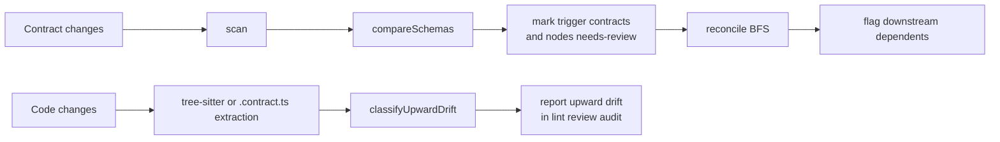

# SpecFerret — Current Architecture

This document describes the architecture that exists in the codebase today.
It is derived from `packages/core` and `packages/cli` only.
If this document and the code disagree, the code is authoritative.

Runtime:

- Bun CLI runtime
- `@specferret/core` for extraction, storage, reconciliation, reporting, and watch utilities
- `@specferret/cli` for command orchestration and human / CI output

---

## System Overview

SpecFerret is a local-first contract drift engine.

It does four things:

1. Extract contracts from markdown specs, TypeScript-native contract files, and TypeScript source.
2. Persist those contracts and their dependency edges in a local graph store.
3. Classify drift in both directions:
   - contract change -> downstream dependents
   - code change -> declared contract
4. Present the result through CLI commands, JSON reports, `context.json`, and a file watcher.

There is no hosted service, no daemon, and no planning-doc parser in the runtime path.
The system is a CLI plus a reusable core library.

```mermaid
flowchart TD
		CLI[CLI Commands\ninit scan lint extract\nreview status watch audit]

		subgraph Inputs[Inputs]
				MD[.contract.md]
				CTS[.contract.ts]
				TS[TypeScript source]
				CFG[ferret.config.json]
		end

		subgraph Core[@specferret/core]
				EX[Extractors]
				VAL[Schema validation\nand comparison]
				STORE[(SQLite / Postgres)]
				REC[Reconciler\nBFS + integrity checks]
				CTX[context.json writer]
				REP[Status / Audit / Watch helpers]
		end

		CLI --> CFG
		CLI --> EX
		MD --> EX
		CTS --> EX
		TS --> EX
		EX --> VAL
		VAL --> STORE
		STORE --> REC
		STORE --> CTX
		STORE --> REP
		REC --> REP

		REP --> OUT1[Human CLI output]
		REP --> OUT2[JSON output]
		CTX --> OUT3[.ferret/context.json]
```

---

## Package Structure

### `packages/cli`

The CLI entry point is `packages/cli/bin/ferret.ts`.
It loads eight commands in parallel:

- `init`
- `scan`
- `lint`
- `extract`
- `review`
- `status`
- `watch`
- `audit`

The CLI layer is orchestration only. Most actual logic lives in `@specferret/core`.

### `packages/core`

The core package exports the current public architecture surface from `packages/core/src/index.ts`:

- extractor modules
- context writer
- store interface and implementations
- reconciler
- config and path utilities
- TypeScript-native contract helpers
- status builder
- watch helper
- audit builder

---

## Architectural Components

The current implementation is best understood as eight components rather than the older five-layer model.

| Component                  | Responsibility                                                                                   | Primary files                                                                                                                                        |
| -------------------------- | ------------------------------------------------------------------------------------------------ | ---------------------------------------------------------------------------------------------------------------------------------------------------- |
| CLI orchestration          | Parse flags, call core, print, exit                                                              | `packages/cli/bin/ferret.ts`, `packages/cli/bin/commands/*.ts`                                                                                       |
| Config and path resolution | Load `ferret.config.json`, find project root                                                     | `packages/core/src/config.ts`, `packages/core/src/utils/paths.ts`                                                                                    |
| Extraction                 | Turn files into normalized contract records                                                      | `packages/core/src/extractor/frontmatter.ts`, `packages/core/src/extractor/typescript-contract.ts`, `packages/core/src/extractor/typescript.ts`      |
| Validation and comparison  | Validate contract types, warn on unsupported schema keywords, classify drift                     | `packages/core/src/extractor/validator.ts`, `packages/core/src/extractor/upward-classifier.ts`                                                       |
| Store                      | Persist nodes, contracts, dependencies, review logs, placement decisions                         | `packages/core/src/store/types.ts`, `packages/core/src/store/sqlite.ts`, `packages/core/src/store/postgres.ts`, `packages/core/src/store/factory.ts` |
| Reconciliation             | Validate graph integrity, walk dependency graph, flag downstream impact, suggest missing imports | `packages/core/src/reconciler/index.ts`, `packages/core/src/reconciler/import-suggestions.ts`                                                        |
| Reporting                  | Build status, review, audit, and context snapshots                                               | `packages/core/src/status/index.ts`, `packages/core/src/context/index.ts`, `packages/core/src/audit/index.ts`, `packages/cli/bin/commands/review.ts` |
| Watch                      | Watch contract files and rerun lint                                                              | `packages/core/src/watch/index.ts`, `packages/cli/bin/commands/watch.ts`                                                                             |

---

## Contract Inputs

The current code supports three inputs.

### 1. Markdown contracts

File format: `.contract.md`

Extractor: `extractFromSpecFile()` in `packages/core/src/extractor/frontmatter.ts`

Implementation details:

- Uses `gray-matter`
- Reads `ferret.id`, `ferret.type`, `ferret.shape`
- Optionally reads `ferret.imports`, `ferret.status`, `ferret.source.file`, `ferret.source.symbol`
- Normalizes status with this mapping:
  - `active` or `complete` -> `stable`
  - anything else -> `pending`
- Returns `warning: 'no-frontmatter'` when the file has no `ferret:` block

### 2. TypeScript-native contract files

File format: `.contract.ts`

Extractor: `extractFromContractFile()` in `packages/core/src/extractor/typescript-contract.ts`

Implementation details:

- Uses Bun `import()` at runtime
- Detects exported values via `isContract()` from `packages/core/src/contract.ts`
- Converts `output` Zod shapes to JSON Schema with `z.toJSONSchema()`
- Resolves `consumes` into dependency imports
- Uses `source.file` and `source.symbol` when provided
- Defaults `sourceFile` to the contract file and `sourceSymbol` to the export name

### 3. TypeScript source files

File format: regular `.ts` source files

Extractor: `extractContractsFromTypeScript()` in `packages/core/src/extractor/typescript.ts`

Implementation details:

- Uses `tree-sitter` and `tree-sitter-typescript`
- Extracts exported interfaces, type aliases, enumerations, and functions
- Generates deterministic inferred contract IDs when explicit metadata is absent
- Produces hard `errors` and soft `diagnostics`
- Is used in two places:
  - `ferret extract` to scaffold `.contract.md` files
  - upward drift checks to compare live code against stored contract schemas

---

## Type System and Contract Model

### Contract categories

The code enforces a closed set of contract types in `packages/core/src/extractor/contract-types.ts`:

- `api`
- `table`
- `type`
- `event`
- `flow`
- `config`

### TypeScript-native contract authoring

`packages/core/src/contract.ts` defines the runtime shape for `.contract.ts` exports.

Important fields:

- `id`
- `value`
- `output`
- `invariants`
- `consumes`
- `dependsOn`
- `forbids`
- `status`
- `source`
- `closedBy`
- `closedWhen`

`defineContract()` returns the contract plus `schema: z.object(output)`.

### Normalized extraction output

All extractors converge on the same normalized shape:

- `filePath`
- `fileType` as `spec` or `code`
- `contracts[]`
- `extractedBy` as `gray-matter`, `tree-sitter`, or `typescript`
- `extractedAt`

Each extracted contract record contains:

- `id`
- `type`
- `shape`
- `shape_hash`
- `imports`
- optional `contractStatus`
- optional `sourceFile`
- optional `sourceSymbol`

---

## Store and Persisted Graph Model

The persistence interface is `DBStore` in `packages/core/src/store/types.ts`.

The store persists five table families:

1. `ferret_nodes`
2. `ferret_contracts`
3. `ferret_dependencies`
4. `ferret_reconciliation_log`
5. `ferret_placement_decisions`

SQLite is implemented in `packages/core/src/store/sqlite.ts`.
Postgres is implemented in `packages/core/src/store/postgres.ts`.
Store selection happens in `packages/core/src/store/factory.ts`.

Selection rules:

- `FERRET_DATABASE_URL` -> Postgres
- else `config.store === 'postgres'` without env -> hard fail
- else `.ferret/graph.db` if present -> SQLite
- else SQLite by default

### Persisted node model

`FerretNode` fields:

- `id`
- `file_path`
- `hash`
- `status`
- `updated_at`

`NodeStatus` values:

- `stable`
- `needs-review`
- `pending`
- `blocked`

### Persisted contract model

`FerretContract` fields:

- `id`
- `node_id`
- `shape_hash`
- `shape_schema`
- `type`
- `status`
- optional `code_source_file`
- optional `code_source_symbol`

`ContractStatus` values:

- `stable`
- `pending`
- `needs-review`

### Persisted dependency model

Dependencies are edges from a source node to a target contract ID.

That means:

- one file can export one or more contracts
- one file can depend on many contracts
- reconciliation is contract-triggered, but node statuses are what get flagged

### Migration details

The SQLite store migrates legacy `roadmap` statuses to `pending` on init.
The context writer also migrates `context.json` v2 to v3 semantics.

---

## Validation and Drift Classification

The schema validator and comparison logic live in `packages/core/src/extractor/validator.ts`.

### Validation

Contract type validation is strict.

JSON Schema validation is permissive:

- unsupported keywords do not fail extraction
- they emit warnings instead

Unsupported keywords currently include:

- `$ref`
- `allOf`
- `anyOf`
- `oneOf`
- `not`
- `if` / `then` / `else`
- `$defs`
- `definitions`
- `patternProperties`
- `dependencies`

### Downward classification rules

`compareSchemas()` classifies changes as:

- `breaking`
- `non-breaking`
- `no-change`

Breaking examples in code:

- type changed
- required field removed
- required field added
- enumerated value removed
- property removed
- array item type changed

Non-breaking examples in code:

- optional field added
- enumerated value added

No-change means the schemas are semantically identical.

### Upward classification rules

`classifyUpwardDrift()` in `packages/core/src/extractor/upward-classifier.ts` reuses `compareSchemas()`.

That gives the code -> contract path the same taxonomy:

- `BREAKING`
- `NON_BREAKING`
- `NOOP`

---

## Reconciler

The reconciler is implemented in `packages/core/src/reconciler/index.ts`.

Its job is not extraction. Its job is graph reasoning.

Current responsibilities:

1. Load nodes, contracts, and dependencies from the store.
2. Validate import integrity.
3. Suggest likely missing imports.
4. Find trigger contracts by selecting contracts whose parent node is `needs-review`.
5. Perform breadth-first propagation across downstream dependents.
6. Mark impacted nodes as `needs-review`.
7. Return a `ReconcileReport`.

### Import integrity checks

The reconciler explicitly reports:

- unresolved imports
- self imports
- circular imports
- orphaned contracts

When integrity violations exist, reconciliation returns `consistent: false` and stops propagation.

### BFS propagation

Propagation characteristics:

- downstream only
- starts from trigger contracts
- walks via dependency edges
- caps transitive traversal at depth 10
- skips nodes already in `needs-review` or `pending`

### Suggestions

The reconciler can also emit non-blocking import suggestions through `suggestMissingImports()`.

---

## Context Snapshot

`packages/core/src/context/index.ts` writes `.ferret/context.json` after every scan.

Current context version:

- `version: "3.0"`
- `schemaVersion: "1.0.0"`

The context file contains:

- `contracts[]`
- `edges[]`
- `needsReview[]`
- generation timestamp

Each context contract carries:

- `id`
- `type`
- parsed `shape`
- `status`
- `specFile`
- `codeFile`

This file is used as the committed CI baseline in `lint --ci --ci-baseline committed`.

---

## Command Flows

### `ferret init`

Primary file: `packages/cli/bin/commands/init.ts`

Flow:

- creates `.ferret/`
- writes `.ferret/.gitignore`
- initializes SQLite store and tables
- writes starter `ferret.config.json`
- writes `contracts/example.contract.md`
- writes `CLAUDE.md`
- can install a pre-commit hook that runs `ferret lint --changed`

### `ferret scan`

Primary file: `packages/cli/bin/commands/scan.ts`

Flow:

1. Load config and store.
2. Discover `.contract.md` files from `specDir` and `filePattern`.
3. Auto-discover `.contract.ts` files unless `contractParsers.typescript === false`.
4. Optionally narrow to staged files with `--changed`.
5. Extract each file.
6. Compare each contract against the stored version.
7. Set status based on downward comparison.
8. Auto-promote pending contracts to stable when an external `source` resolves clean and upward drift is `NOOP`.
9. Write nodes, contracts, and dependencies back to the store.
10. Rewrite `.ferret/context.json`.

Scan is the mutation entry point for graph state.

### `ferret lint`

Primary file: `packages/cli/bin/commands/lint.ts`

Flow:

1. Optionally restore the committed `context.json` baseline in CI mode.
2. Run `scan` quietly.
3. Reconcile downward drift and integrity violations.
4. Run upward drift checks by re-extracting live code for contracts with `code_source_file` and `code_source_symbol`.
5. Print human output or JSON diagnostics.
6. Exit non-zero for drift in CI mode or when performance budget is exceeded.

This is the primary daily enforcement command.

### `ferret extract`

Primary file: `packages/cli/bin/commands/extract.ts`

Flow:

- globs TypeScript files from `config.codeContracts.include` or `src/**/*.ts`
- runs tree-sitter extraction
- maps inferred contract IDs to deterministic markdown file paths
- generates or updates `.contract.md` files under `specDir`
- emits diagnostics for invalid IDs, collisions, and partial extraction issues

This command bridges code-first TypeScript source into markdown contracts.

### `ferret review`

Primary file: `packages/cli/bin/commands/review.ts`

Flow:

- runs scan quietly
- runs reconcile
- builds reviewable downward-drift items
- builds upward-drift review items
- records review actions in `ferret_reconciliation_log`
- can emit JSON or interactive guidance

Supported review actions:

- `accept`
- `update`
- `reject`

### `ferret status`

Primary files:

- `packages/cli/bin/commands/status.ts`
- `packages/core/src/status/index.ts`

Flow:

- summarizes current contract statuses
- counts dependents per contract
- can emit JSON or write `STATUS.md`
- always exits 0

### `ferret audit`

Primary files:

- `packages/cli/bin/commands/audit.ts`
- `packages/core/src/audit/index.ts`

Flow:

- runs reconcile
- builds status report
- reruns upward drift checks
- returns a read-only bidirectional report
- always exits 0

### `ferret watch`

Primary files:

- `packages/cli/bin/commands/watch.ts`
- `packages/core/src/watch/index.ts`

Flow:

- watches `specDir` recursively
- reacts to `.contract.md` and `.contract.ts` changes only
- debounces events
- reruns `ferret lint`
- does not implement business logic itself

---

## Bidirectional Drift Model

The current code implements bidirectional drift enforcement.



### Downward direction

Declared contract changes are detected during `scan`.
When a stored contract and extracted contract differ, the contract status is updated.
`lint` then uses the reconciler to flag dependent nodes.

### Upward direction

For contracts that carry code source metadata:

- `.contract.md` contracts can point at `source.file` and `source.symbol`
- `.contract.ts` contracts persist `code_source_file` and `code_source_symbol`

`lint`, `review`, and `audit` re-extract the live code shape and compare it with the stored declared schema.

Extraction strategy:

- target ends with `.contract.ts` -> use `extractFromContractFile()`
- any other TypeScript file -> use `extractContractsFromTypeScript()`

That is how the repo currently enforces code -> contract drift.

---

## Performance and Execution Characteristics

Current code-level characteristics:

- no external service dependency in the default path
- synchronous markdown extraction
- SQLite default store with WAL mode
- tree-sitter for static TypeScript source extraction
- runtime import for `.contract.ts`
- file hash short-circuiting in `scan`
- optional performance budgets in `lint` and `extract`

Watch mode is event-driven and reuses the CLI rather than embedding reconciliation logic in the watcher.

---

## What The Current Code Does Not Do

Based on the implementation currently checked in, SpecFerret does not:

- parse planning docs or sprint stories directly
- infer contracts from non-TypeScript implementation languages
- run as a background server
- require a hosted control plane
- enforce schema keywords beyond its supported JSON Schema subset

Any document that claims those runtime paths should be treated as stale unless the code gains them.

---

## Canonical Mental Model

The current architecture is:

- a Bun CLI
- backed by a reusable core library
- storing a local contract graph
- extracting shapes from markdown, `.contract.ts`, and TypeScript source
- classifying drift in both directions
- surfacing results through lint, review, status, audit, watch, and `context.json`

That is the architecture implemented in code today.
